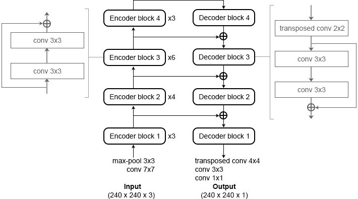

# Нейронная сеть для семантической сегментации фотографий

Этот репозиторий содержит код нейронной сети для отделения человека на фотографии от фона, которая использовалась в решении задачи с конкурса [PicsArt AI Hackaton Online](https://github.com/datasouls/picsart-online). Подробно эта сеть описана в моей статье ["Применение сверточных нейронных сетей в задаче семантической сегментации фотографий"](www.apmath.spbu.ru/ru/research/conference/pm/archive/2019/cps2019.pdf#page=374).

## Запуск кода
Код решения оформлен в виде Jupyter Notebook-ов.

Для того, чтобы обучить сеть, запустите [model.ipynb](./model.ipynb).
Датасет, использующийся в конкурсе, доступен по этой ссылке - [picsart_hack_online_data.zip](https://s3.eu-central-1.amazonaws.com/datasouls/public/picsart_hack_online_data.zip).
Я не несу ответственность за доступность ссылки и все такое. Данные должны находиться в папке *data/*.

Для того, чтобы проверить работу сети на видеофиде с вебкамеры, запустите [example.ipynb](./example.ipynb).
Для этого веса обученной сети должны находиться в файле *weights/ln34_best*.

## Описание архитектуры
Для решения задачи использовалась сверточная сеть, основанная на архитектуре U-Net.
В финальном решении комбинирование карт признаков в блоках декодера производилость сложением, а не конкатенацией.
Это роднит данную сеть с другой архитектурой - LinkNet.

Для улучшения точности использовалась аугментация входных изображений - random-crop, случайное отражение по горизонтали.
